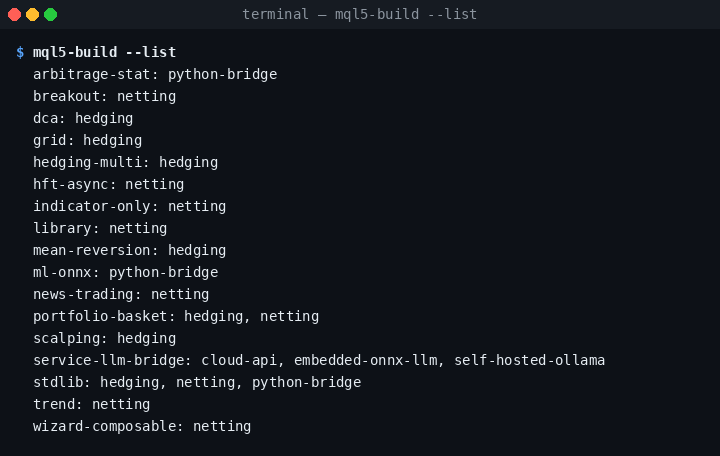
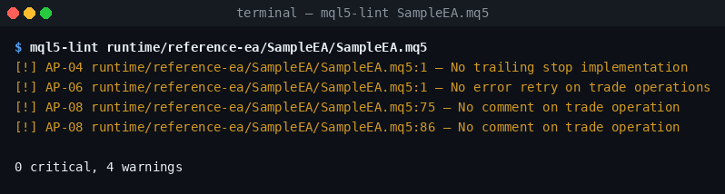
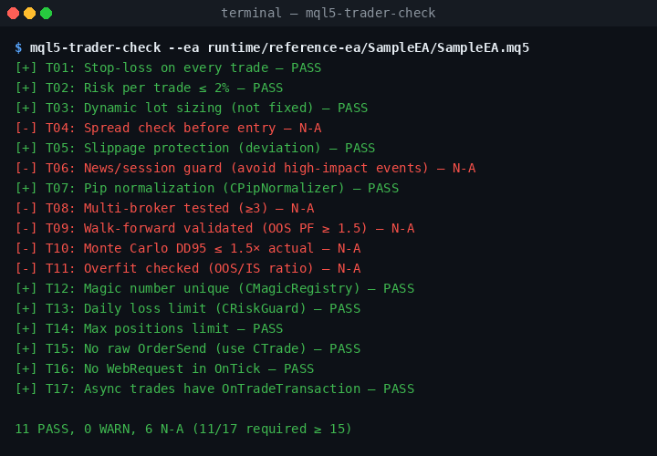
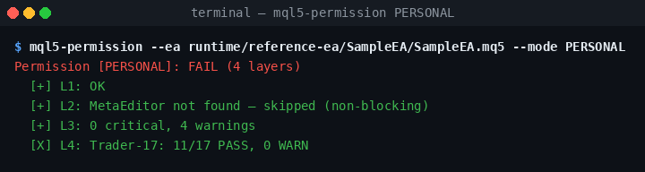

# Quickstart — 15 minutes

A short, honest tour through `vibecodekit-mql5-ea`. By the end you will have a
fresh MQL5 EA scaffold, run the lint and pre-deploy gates against it, and
understand what each gate is actually measuring.

> 🇻🇳 Vietnamese version: [`QUICKSTART.vi.md`](QUICKSTART.vi.md)

> **Heuristic disclosure.** `Trader-17`, the `8×8 quality matrix`, the `AP-XX`
> anti-pattern IDs, and the `RRI` personas are project-defined heuristics
> designed by this kit. They are opinionated guardrails — not industry
> standards. Treat them accordingly.

---

## 0. Prerequisites (2 min)

- Python ≥ 3.10
- `git` + a shell

Optional (for real MQL5 compilation):

- Wine + a copy of `metaeditor64.exe` somewhere on `PATH` (the kit reports
  `MetaEditor not found — skipped (non-blocking)` when it is missing, and the
  rest of the gates still run).

---

## 1. Install the kit (1 min)

```bash
git clone https://github.com/VibeMql5Codekit/vibecodekit-mql5-ea.git
cd vibecodekit-mql5-ea
pip install -e ".[dev]"
```

Verify:

```bash
mql5-build --list
```

You should see ~17 scaffold presets:



---

## 2. Scaffold a new EA (1 min)

```bash
mql5-build \
  --preset stdlib \
  --stack netting \
  --name SampleEA \
  --output ./out
```

Output:

```
Rendered stdlib/netting -> ./out/SampleEA
```

Open `./out/SampleEA/SampleEA.mq5`. It already includes:

- `CPipNormalizer` (cross-broker pip math: 5d EURUSD, 4d USDJPY, 3d XAUUSD-Exness, 2d XAUUSD-ICM)
- `CRiskGuard` (daily loss limit + max-positions enforcement)
- `CMagicRegistry` (per-symbol magic-number collision check)
- `CTrade` from MetaTrader's standard library

The strategy logic block is intentionally empty:

```cpp
bool buySignal  = false;  // Replace with your buy condition
bool sellSignal = false;  // Replace with your sell condition
```

This is your only required edit. Replace the two booleans with real signals.

---

## 3. Lint the scaffold (1 min)

```bash
mql5-lint ./out/SampleEA/SampleEA.mq5
```

You should see 0 critical findings and 4 placeholder warnings:



The warnings are template artefacts (no trailing stop, no retry, no trade
comment). They will not block the gate; you can address them later.

> **What the linter does NOT do.** It is regex-based. AP-05 ("> 6 inputs")
> is an opinionated default that triggers on legitimate grid / portfolio EAs.
> Edit `scripts/vibecodekit_mql5/lint.py` if you need to adjust thresholds.

---

## 4. Run the Trader-17 checklist (1 min)

```bash
mql5-trader-check --ea ./out/SampleEA/SampleEA.mq5
```

On a bare scaffold you'll see something like:



`11 / 17 PASS, 6 N-A` — the gate **fails** (it requires ≥ 15 PASS). The `N-A`
items (T08–T11, T04, T06) need external evidence the kit cannot infer from
source alone: walk-forward, Monte Carlo, multi-broker, overfit, news filter,
spread guard. Wire those up via `mql5-walkforward`, `mql5-monte-carlo`,
`mql5-multibroker`, etc., once you have backtest reports.

> **Honest note.** Trader-17 is a project-defined checklist, not an industry
> certification. The thresholds in `scripts/vibecodekit_mql5/trader_check.py`
> reflect this kit's opinion on prudent retail EA hygiene.

---

## 5. Run the permission gate (2 min)

```bash
mql5-permission --ea ./out/SampleEA/SampleEA.mq5 --mode PERSONAL
```

You'll get a fail-fast report:



The pipeline runs layers in order and stops at the first failure. The mode
controls which layers run:

| Mode | Layers | Threshold |
|---|---|---|
| `PERSONAL` | 1, 2, 3, 4, 7 | Light gate for solo dev work |
| `TEAM` | 1, 2, 3, 4, 5, 7 | Adds methodology layer |
| `ENTERPRISE` | 1, 2, 3, 4, 5, 6, 7 | Adds the 8×8 quality matrix |

A bare scaffold is **expected to fail** at layer 4 — that is the whole point
of the gate. To get a PASS, you need a working strategy plus backtest
evidence; the kit will not certify an empty template.

Machine-readable output:

```bash
mql5-permission --ea ./out/SampleEA/SampleEA.mq5 --mode PERSONAL --json
```

---

## 6. Iterate (≈ 10 min)

A realistic loop:

1. Edit `OnTick` in `SampleEA.mq5` to compute your `buySignal` / `sellSignal`.
2. Re-run `mql5-lint` — fix any new criticals it surfaces.
3. Compile in MetaEditor (or via `mql5-compile` if you have it on `PATH`).
4. Run a backtest in MT5's Strategy Tester; export the report XML.
5. Feed it through `mql5-backtest`, `mql5-walkforward`, `mql5-monte-carlo`.
6. Re-run `mql5-trader-check` and `mql5-permission` until the gate passes at
   your target mode.

For a concrete, reproducible snapshot of what each gate reports on a freshly
scaffolded EA, see [`reference-ea/REPORT.md`](reference-ea/REPORT.md).

---

## Where next

- **AI coding agents (Devin, Claude Code, Cursor, Codex):** read
  [`/AGENTS.md`](../AGENTS.md) before authoring changes.
- **Strategy intake from a free-form idea:** see the Prompt Architect schema in
  [`prompt-architect/README.md`](prompt-architect/README.md).
- **Full reference:** [`GUIDE-COMPLETE.md`](GUIDE-COMPLETE.md).

---

## FAQ

**Q. Why does a bare scaffold fail the permission gate?**

Because the gate is not a syntax check. It demands real evidence
(walk-forward, Monte Carlo, multi-broker, working strategy logic) before
clearing an EA for deployment. A fresh template should fail — if it passed,
the gate would be theatre.

**Q. The `8×8 quality matrix` shows 56/64 PASS without me doing anything.**

That number is a structural maximum, not a measurement. `mql5-rri-bt` marks
every non-`live-canary` cell as PASS by default unless you supply a backtest
report that fails. The matrix is most useful as a checklist of dimensions to
cover, not as a score.

**Q. Can I disable a single anti-pattern for one file?**

Not today. There is no per-file suppression directive (e.g. `// vibekit-disable
AP-05`) — by design, to keep the gate's contract visible. If a rule is wrong
for your use case, edit it in `scripts/vibecodekit_mql5/lint.py` and open a PR.

**Q. The CLI surface is huge (46 commands). Where do I actually start?**

The five you'll use most days: `mql5-build`, `mql5-lint`, `mql5-trader-check`,
`mql5-permission`, `mql5-compile`. Everything else is auxiliary and you can
ignore it until you need it.

**Q. Is this production-ready for live trading?**

The libraries (`CPipNormalizer`, `CRiskGuard`, `CMagicRegistry`) are
production-grade hygiene. The strategy is whatever you write in `OnTick` —
the kit makes no claim about its profitability. Always demo-trade first.
